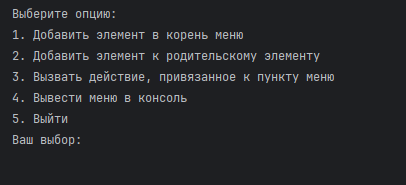

# job4j_clean_code_lsp

## О проекте

Описание

Реализовать структуру для поддержания меню.

Каждый элемент меню имеет имя.

Каждый пункт меню может быть как одиночным элементом, так и иметь дочерние подпункты.

Все меню должно выводиться на экран в виде дерева.

Предусмотреть возможность определять действие, когда пользователь выбирает конкретный пункт меню.

Например:

1. Задача Общая.

----1.1. Задача Первая.

---------1.1.1. Цель задачи.

---------1.1.2. Ограничения и требования к решению.

-----1.2. Задача Вторая.

Запуск проекта

* Запустить метод main из класса TodoApp находящийся по пути \src\main\java\ru\job4j\ood\isp\menu\TodoApp.java

Внешний вид запущенного приложения

